<!--
  ╔══════════════════════════════════════════════════════════════╗
  ║           Farhad Navayazdan · GitHub Profile README          ║
  ║      Deep metrics regenerated daily via GitHub Actions.      ║
  ╚══════════════════════════════════════════════════════════════╝
-->

# Farhad Navayazdan

### Senior Software Developer · 14+ Years · Oil & Gas · Distributed Systems · AI

  
  
  
  
  
  

---

## 👨‍💻 About

Innovative **Senior Software Developer with 14+ years of experience** delivering high-impact, scalable software solutions — including specialized applications for the **oil and gas** sector. Adept at solving complex technical challenges, optimizing **system performance**, and leading projects from concept to deployment. Passionate about leveraging modern development techniques and technologies to drive efficiency and innovation in **industrial software systems**.

> Pragmatic engineering. Clean architecture. Systems that hold up under production load.

---

## 🧠 Tech Stack

<table>
  <tr>
    <td valign="top" width="50%">
      <h3>Languages</h3>
      
      
      
      
      
      
      
    </td>
    <td valign="top" width="50%">
      <h3>Frameworks</h3>
      
      
      
      
      
      
      
      
      
      
    </td>
  </tr>
  <tr>
    <td valign="top" width="50%">
      <h3>Systems · DevOps · Cloud</h3>
      
      
      
      
      
    </td>
    <td valign="top" width="50%">
      <h3>Databases</h3>
      
      
      
      
    </td>
  </tr>
  <tr>
    <td valign="top" width="50%">
      <h3>Networking & Real-Time</h3>
      
      
      
      
    </td>
    <td valign="top" width="50%">
      <h3>AI & Architecture</h3>
      
      
      
      
      
    </td>
  </tr>
</table>

---

## 📈 Deep Metrics · Refreshed Daily

> Regenerated **every day at 00:00 UTC** by a [GitHub Action](.github/workflows/metrics.yml) using [`lowlighter/metrics`](https://github.com/lowlighter/metrics).

<h3>📌 Profile Overview</h3>

<h3>💬 Language Breakdown</h3>

<h3>🗓️ Contribution Calendar</h3>

---

## 📜 Certifications

  
  
  
  

---

## 🏆 Awards

  
  
  

---

## 🤝 Let's Connect

If you're working on **backend engineering, distributed systems, oil & gas software, or practical AI integration** — I'd love to hear from you.

| | |
|---|---|
| 🌐 **Website**     | [falhad.dev](https://falhad.dev) |
| 📫 **Email**       | [cs.arcxx@gmail.com](mailto:cs.arcxx@gmail.com) |
| 💼 **LinkedIn**    | [linkedin.com/in/farhadnava](https://www.linkedin.com/in/farhadnava/) |
| 🧵 **Stack Overflow** | [Farhad Navayazdan](https://stackoverflow.com/users/3917083/farhad-navayazdan) |

---

Thanks for stopping by. Feel free to ⭐ any project you find useful.

